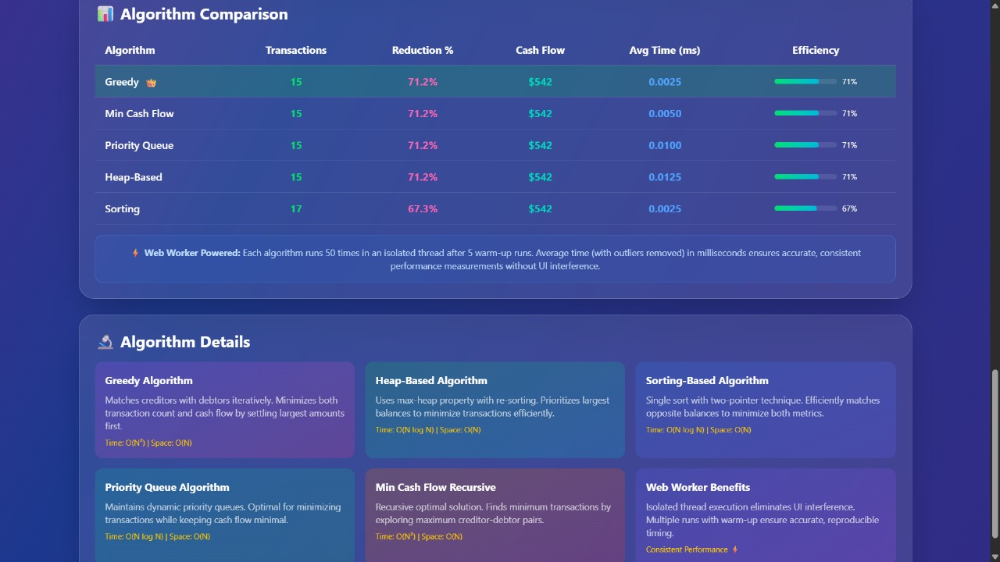
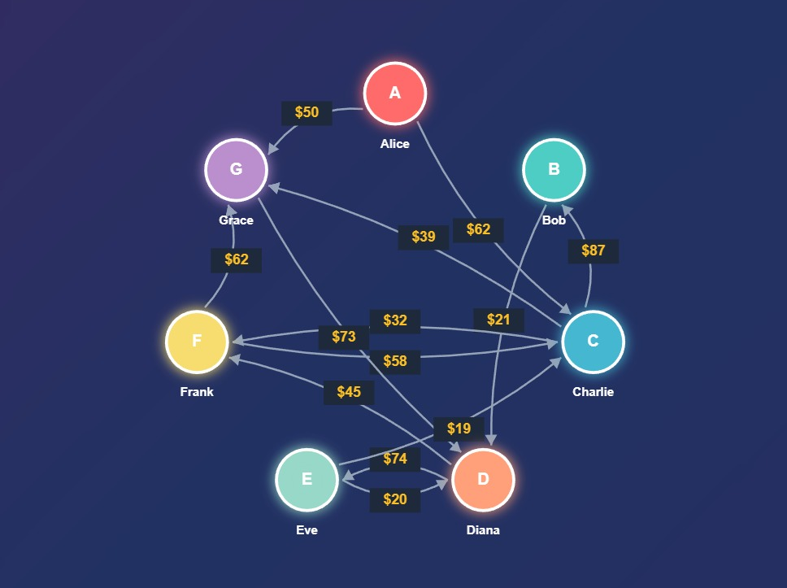
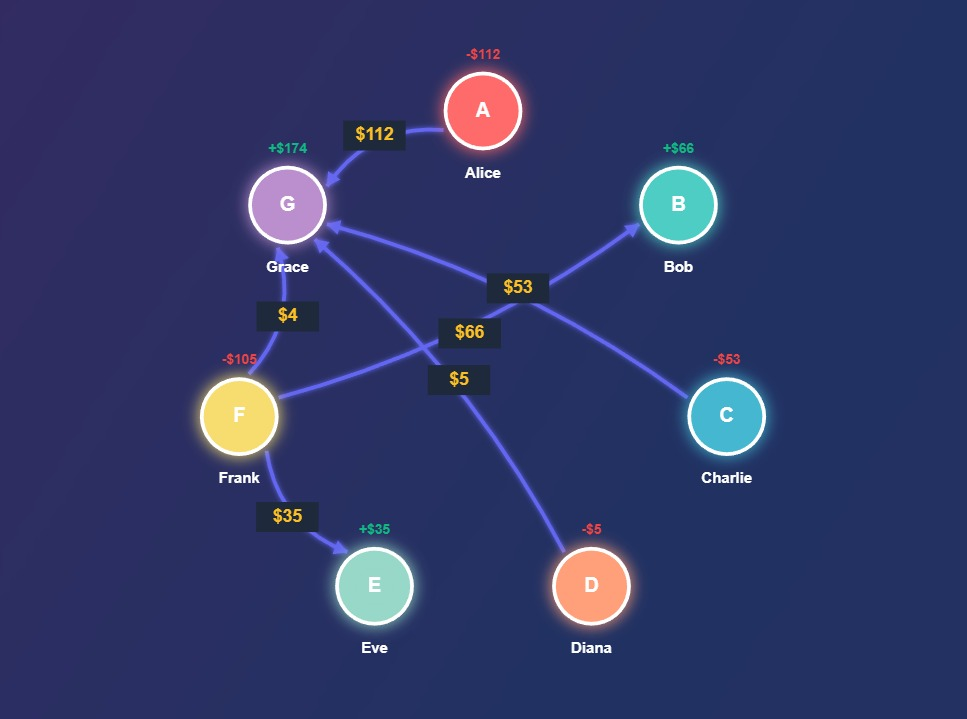

# CashFlow Minimizer and Transaction Visualizer

A React + Vite based transaction optimization and visualization platform designed to minimize redundant cash transactions between multiple participants using graph-based algorithms.

The project benchmarks multiple settlement strategies, visualizes transaction flows, and compares optimization efficiency through an interactive dashboard.

---

# Overview

In group payment systems, transactions between participants often become unnecessarily complex.

Example:

Instead of:

- A → B → C

the system optimizes the settlement into:

- A → C

thereby reducing:
- redundant transactions
- unnecessary intermediate transfers
- settlement complexity

---

# Features

- Cashflow minimization
- Interactive transaction graph visualization
- Multiple algorithm comparison
- Real-time benchmarking dashboard
- Optimized transaction flow generation
- Modular React architecture
- Web Worker based performance benchmarking

---

# Algorithms Implemented

The platform compares different optimization approaches including:

- Greedy Algorithm
- Min Cash Flow Algorithm
- Heap-Based Optimization
- Priority Queue Based Settlement
- Sorting-Based Optimization

Each algorithm is benchmarked based on:
- execution time
- transaction reduction
- optimization efficiency
- settlement complexity

---

# Tech Stack

## Frontend
- React
- Vite
- HTML
- CSS
- JavaScript

## Concepts Used
- Graph Algorithms
- Greedy Optimization
- Heap / Priority Queue Concepts
- Net Balance Computation
- Transaction Minimization
- Web Workers

---

# Project Structure

```bash
src/
├── algorithms/         # Cashflow minimization algorithms
├── components/         # Reusable React components
├── utils/              # Helper and utility functions
├── visualization/      # Graphs and visualization logic
├── workers/            # Benchmarking and worker-thread logic
├── App.jsx
├── main.jsx
├── App.css
└── index.css
```

---

# Algorithm Comparison Dashboard



The dashboard benchmarks different minimization techniques and compares their efficiency and execution performance.

---

# Transaction Visualization

## Original Transaction Flow



## Optimized Transaction Flow



The optimized graph significantly reduces unnecessary intermediate transactions while preserving final balances.

---

# Working Principle

## Step 1: Transaction Input

Transactions between participants are provided as input.

---

## Step 2: Net Balance Calculation

For each participant:
- Positive balance → amount to receive
- Negative balance → amount to pay

---

## Step 3: Cashflow Minimization

The algorithms directly settle balances between debtors and creditors while minimizing transaction count and transaction complexity.

---

## Step 4: Benchmarking & Visualization

The platform:
- benchmarks multiple optimization algorithms
- visualizes transaction graphs
- compares execution performance

Web Workers are used for non-blocking benchmarking and smoother UI responsiveness.

---

# Running the Project

## Install Dependencies

```bash
npm install
```

## Start Development Server

```bash
npm run dev
```

The application will run locally on:

```bash
http://localhost:5173/
```

---

# Applications

The concepts used in this project are relevant to:

- Expense splitting applications
- Financial settlement systems
- Payment optimization engines
- Group transaction platforms

---

# Future Improvements

- Live deployment support
- Dynamic graph editing
- Real-time collaborative settlements
- Advanced graph analytics
- Backend and database integration

---

# Contributors

- Devang
- Vinamra
- Gurtej
- Darsh

---

# Status

Completed as part of a Data Structures & Algorithms course project and currently being improved for scalability, visualization, and modularity.
